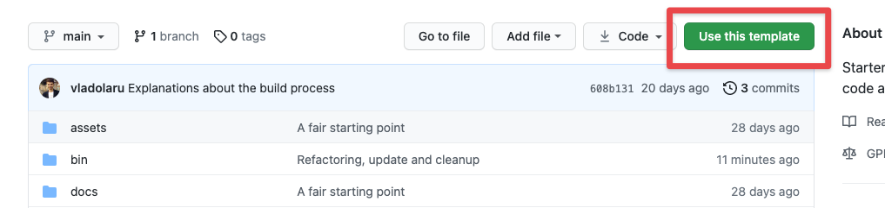

# Pressody Part Template

Starter WP plugin template for the code attached to Pressody (PD) Parts (companion PD Part plugin).

## About

Use this as your starting point for coding the integration of an PD Part (managed by PD Records).

## Developing a new Pressody Part plugin

If you know what you are doing you can go any number of ways towards developing a companion PD Part plugin, even ignoring this template and starting fresh. But lets tackle the case when you want to stick to this template.

This template's intention is to **speed up development and make it more error-proof.** By providing **a set of patterns** (like Dependency Injection, Loggers and Log Handlers, etc.), this template ensures you can easily and confidently bolt things together and have your logic behave predictably.

### Step 0 - Decide

Before tackling repos and files, **you need to make some decisions:**
1. **Decide on your PD Part Composer package name** as this will determine things like plugin directory, main file name, textdomain, etc. Usually you would use the `pressody-records` vendor and a PD part name prefixed with `part_` (e.g. a package name would look like this `pressody-records/part_woocommerce`).
2. **Decide on the PHP base namespace to use.** We _strongly recommend_ you use a namespace like this `Pressody\PartWoocommerce` with `Pressody` as the root (with the exact lowercase and uppercase).
3. Finally, decide on a PD Part title, description, and what version you want to start from (e.g. `0.0.1` or `1.0.0`).

### Step 1 - Create a new GitHub repo

Each PD Part companion plugin should reside in **a separate Git repo,** most likely hosted on GitHub.com. 

**The hard way** would be to:
- create a new, empty GitHub repo yourself
- open a terminal window into your development directory
- clone _this_ repo locally by running `git clone --depth 1 https://github.com/pressody/pressody-part-template your-part-name` (replace `your-part-name` with the actual name you intend to use)
- `cd` into the newly created directory (`your-part-name`)
- change the remote URL to your new, empty GitHub repo by running `git remote set-url origin https://github.com/USERNAME/REPOSITORY.git` and verify the change with `git remote -v`
- finally, push your "changes" to the GitHub repo by running `git push origin`.

**The easy way** is to take advantage of the fact that **this GitHub repo is made available as a template** for creating other repos. So simply click the "Use this template" button and follow the instructions.



After that, **clone the new GitHub repo locally** by running `git clone https://github.com/USERNAME/REPOSITORY.git your-part-name`.

Now you can start setting up your PD Part companion plugin, clean-up, and develop the specific logic.

### Step 2 - Set up your Pressody Part plugin

Now that you have the files as provided by the template, it is time to adapt them to your new PD Part. Again, there is a hard way and an easy way.

**The hard way** would be to:
- go through each file and replace things like textdomain, PHP namespaces, versions, etc.
- change the name of certain files (like the main plugin file)
- delete some files that get in your way.

**The easy way** is to use the already provided **initialisation script.** Do the following:
- install the node packages with `npm install`
- run the `./bin/init` script from the command line; use `./bin/init --help` to get all the explanations on how to use it
- commit your file changes to your repo and you're good to go.

For extra help, here is a full command to start from:
```shell
./bin/init \
	--packageName="pressody-records/part_woocommerce" \
	--title="Pressody Part WooCommerce" \
	--namespace="Pressody\PartWoocommerce" \
	--description="This is a description." \
	--version="0.5.0" \
	--githubURL="https://github.com/ohoo/part-woocommerce" \
	--dryRun
```
You should **keep the quotes** on arguments values to save you from the need to escape values like the namespace!

Please note that the initialisation script can\'t decide for you. It just does the monkey-work in a thorough way. _You_ should cleanup this `README.md` of these instructions, decide what you want to keep in `/docs`, etc.

If you are after **a bare-bones PD Part companion plugin** (one that does nothing), just add the `--bareBones` argument to the command above.

## Development

### Building a new release

Since this is ultimately a WordPress plugin, you wil need to **generate a cleaned-up .zip file when you wish to publish a new release.**

To generate a new release ZIP file you have the utility script `bin/archive`. You can run it as such, without any arguments, or you can provide a version like so `bin/archive --version=1.0.2`. If you don't provide a version, the release version will be fetched from the plugin's main file headers.

Once the version has been deduced, **the script will enforce it** in the plugin's main .php file and in the `package.json` file. This way everything is kept in sync.

For the `bin/archive` script there are a couple of **things that are important:**
* the `name` entry in `package.json` is **the same** as the plugin main file (minus the `.php` extension)
* **the files and directories that will be included** in the release file need to be explicitly specified in the `distFiles` entry in `package.json`

The `bin/archive` script will also generate a fresh `.pot` language file in the `languages` directory, before creating the release file. This way you can be sure that the `.pot` file is not out-of-sync.

**The resulting release file will be located in the `dist` directory,** in your plugin directory (it is ignored by Git).

### Running Tests

To run the PHPUnit tests, in the root directory of the plugin, run something like:

```
./vendor/bin/phpunit --testsuite=Unit --colors=always
```
or
```
composer run tests
```

Bear in mind that there are **simple unit tests** (hence the `--testsuite=Unit` parameter) that are very fast to run, and there are **integration tests** (`--testsuite=Integration`) that need to load the entire WordPress codebase, recreate the db, etc. Choose which ones you want to run depending on what you are after.

You can run either the unit tests or the integration tests with the following commands:

```
composer run tests-unit
```
or
```
composer run tests-integration
```

**Important:** Before you can run the tests, you need to create a `.env` file in `tests/phpunit/` with the necessary data. You can copy the already existing `.env.example` file. Further instructions are in the `.env.example` file.

## Credits

...
